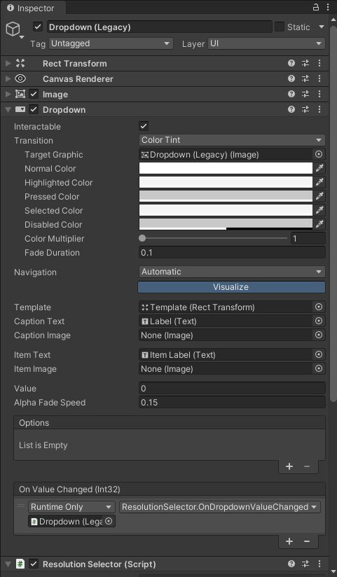
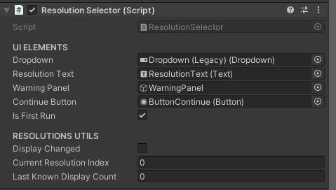

# 🎛️ Resolution Selector for Unity

[](https://unity3d.com/get-unity/download)
[](LICENSE.md)
[](#)
[](CONTRIBUTING.md)
[](https://twitter.com/K41t0M)

> Un sencillo y eficiente selector de resolución para tus proyectos de Unity, compatible con múltiples plataformas y fácil de integrar.

---
✨🌷 ¡Hola, pequeños devs!💖 Soy **KaitoArtz**, y estoy emocionado de compartir este proyecto contigo.

Este repositorio contiene un script de C# diseñado para Unity (versión 2021.3.15f1 o superior) que permite a los desarrolladores agregar un selector de resolución a través de un menú desplegable (`Dropdown`) en la UI de Unity. Este script es ideal para proyectos que necesitan adaptarse a diferentes resoluciones de pantalla, incluyendo opciones específicas para Steam Deck y plataformas de escritorio.


---

## 📖 Tabla de Contenidos

- [✨ Características](#-características)
- [📦 Instalación](#-instalación)
- [⚙️ Configuración](#️-configuración)
- [🚀 Uso](#-uso)
- [🖼️ Ejemplos Visuales](#️-ejemplos-visuales)
- [📚 Documentación Detallada](#-documentación-detallada)
- [🤝 Contribuciones](#-contribuciones)
- [📄 Licencia](#-licencia)
- [🔗 Enlaces de Interés](#-enlaces-de-interés)
- [📞 Soporte](#-soporte)

---

## ✨ Características

- **Compatibilidad Multiplataforma**: Funciona perfectamente en Windows, macOS, Linux y Steam Deck.
  
- **Detección Automática**: Detecta y actualiza automáticamente las resoluciones disponibles según los monitores conectados.
  
- **Interfaz de Usuario Amigable**: Integra un Dropdown intuitivo para que los usuarios seleccionen la resolución deseada.
  
- **Persistencia de Configuración**: Guarda y carga automáticamente la última resolución seleccionada.
  
- **Personalización Fácil**: Añade o elimina resoluciones soportadas según tus necesidades.
  
- **Manejo de Eventos**: Incluye eventos para responder a cambios de resolución en tiempo real.
  
> [!TIP]
> **¿Sabías que...?** Este script también puede adaptarse para cambiar entre modos de pantalla completa y ventana con facilidad.

---

## 📦 Instalación

### Requisitos Previos

- **Unity** versión **2021.3.15f1** o superior.
- Conocimiento básico de la interfaz de Unity y manejo de scripts.

### Pasos de Instalación

1. **Clona el Repositorio**
   
```bash
git clone https://github.com/KaitoOwO/DropdownResolution.git
```

2. **Importa el Script a tu Proyecto**

Copia el archivo `ResolutionSelector.cs` en la carpeta Scripts de tu proyecto de Unity.

3. **Añade el Componente a un GameObject**

Crea un `GameObject` vacío en tu escena o utiliza uno existente.
Arrastra y suelta el script `ResolutionSelector.cs` sobre el `GameObject`.

4. **Configura la UI**

Añade un `Dropdown (legacy)` a tu Canvas.
Crea un `Panel` de Advertencia opcional para notificar cambios en la pantalla.
Asigna los elementos correspondientes en el Inspector del `ResolutionSelector`.

> [!NOTE]
> Si utilizas el nuevo sistema de UI de Unity, puedes adaptar el script para trabajar con el componente `TMP_Dropdown` de `TextMeshPro`.

---

## ⚙️ Configuración

### Ajuste de Resoluciones Soportadas

El script viene con listas predefinidas de resoluciones para diferentes plataformas. Puedes seleccionar y modificar estas listas según tus necesidades.

#### Resoluciones para Steam Deck

```csharp
private Resolution[] supportedResolutions = new Resolution[] {
    new Resolution() { width = 640, height = 480 },  //(4:3)
    new Resolution() { width = 960, height = 720 },  //(4:3)
    new Resolution() { width = 1280, height = 720 },
    new Resolution() { width = 1066, height = 800 }, //(4:3)
    new Resolution() { width = 1280, height = 800 },
    new Resolution() { width = 1440, height = 1080 }, //(4:3)
    new Resolution() { width = 1920, height = 1080 }
};
```

#### Resoluciones para Escritorio (Windows, macOS, Linux)

```csharp
private Resolution[] supportedResolutions = new Resolution[] {
    new Resolution() { width = 640, height = 480 },
    new Resolution() { width = 960, height = 540 },
    new Resolution() { width = 960, height = 720 },
    new Resolution() { width = 1280, height = 720 },
    new Resolution() { width = 1366, height = 768 },
    new Resolution() { width = 1066, height = 800 },
    new Resolution() { width = 1280, height = 800 },
    new Resolution() { width = 1440, height = 900 },
    new Resolution() { width = 1440, height = 1080 },
    new Resolution() { width = 1920, height = 1080 },
    new Resolution() { width = 2560, height = 1080 },
    new Resolution() { width = 2880, height = 2160 },
    new Resolution() { width = 3840, height = 2160 }
};
```

> [!WARNING]
> Asegúrate de que las resoluciones soportadas sean compatibles con los monitores objetivo para evitar problemas de visualización.

### Configuración del Inspector

- **Dropdown**: Asigna el componente `Dropdown` de tu UI.
- **Warning Panel**: Asigna un `panel` que se mostrará cuando se detecten cambios en las pantallas.
- **Continue Button**: `Botón` para confirmar y aplicar cambios tras detectar una nueva pantalla.
- **Resolution Text**: `Texto` opcional para mostrar la resolución actual al usuario.

---

## 🚀 Uso

### Inicialización Automática

- Al iniciar el juego, el script detecta la resolución óptima y la establece automáticamente.
- Carga la última resolución seleccionada si existe una guardada.

### Selección Manual de Resolución

- El usuario puede seleccionar una resolución diferente desde el Dropdown en cualquier momento.
- El cambio se aplica inmediatamente y se guarda para futuras sesiones.

### Detección de Cambios de Pantalla

- Si se conecta o desconecta un monitor, el script muestra el Warning Panel y actualiza las opciones disponibles.
- Al presionar el `Continue Button`, se aplica la mejor resolución disponible.

> [!TIP]
> Puedes personalizar el intervalo de detección de cambios de pantalla modificando el valor en la corrutina `CheckForDisplayChanges()` dentro del script.

---

## 🖼️ Ejemplos Visuales

### Demo en Acción

Demostración del selector de resolución en el inspector.





### Interacción con el Usuario

El usuario seleccionando diferentes resoluciones desde el Dropdown.


---

## 📚 Documentación Detallada

### Métodos Principales

- **Start()**: Inicializa el selector y configura las opciones disponibles.
  
- **OnDropdownValueChanged(int index)**: Maneja el cambio de selección en el Dropdown y aplica la nueva resolución.
  
- **CheckForDisplayChanges()**: Corrutina que verifica periódicamente cambios en las pantallas conectadas.
  
- **SetResolution(int width, int height)**: Aplica la resolución especificada y ajusta la pantalla en consecuencia.

### Personalización Avanzada

Puedes extender la funcionalidad del script añadiendo métodos y eventos personalizados. Por ejemplo:

#### Agregar Soporte para Pantalla Completa

```csharp
public void ToggleFullScreen(bool isFullScreen)
{
    Screen.fullScreen = isFullScreen;
}
```

#### Responder a Eventos de Cambio de Resolución

```csharp
public event Action<Resolution> OnResolutionChanged;

private void SetResolution(int width, int height)
{
    Screen.SetResolution(width, height, Screen.fullScreen);
    OnResolutionChanged?.Invoke(new Resolution() { width = width, height = height });
}
```

> [!NOTE]
> Consulta el código fuente completo para más detalles y comentarios que te ayudarán a entender y modificar el comportamiento según tus necesidades.

---

## 🤝 Contribuciones

¡Las contribuciones son bienvenidas! Si deseas mejorar este proyecto, sigue estos pasos:

1. Haz un Fork del repositorio.
2. Crea una rama nueva: `git checkout -b feature/nueva-funcionalidad`.
3. Realiza tus cambios y haz commit: `git commit -m 'Agrega nueva funcionalidad'`.
4. Haz push a la rama: `git push origin feature/nueva-funcionalidad`.
5. Abre un Pull Request.

> [!TIP]
> Asegúrate de seguir las convenciones de codificación y agregar comentarios claros para facilitar la revisión.

---

## 📄 Licencia

Este proyecto está licenciado bajo la licencia MIT. Esto significa que eres libre de usar, modificar y distribuir este software de acuerdo con los términos de la licencia.
Consulta el archivo [Licencia](LICENSE.md) para más detalles.

---

## 🔰 Políticas de Privacidad

Este proyecto no recopila información personal ni técnica de los usuarios. Para más detalles, consulta nuestras [Políticas de Privacidad](SECURITY.md).

---

## 🔗 Enlaces de Interés

- **Portfolio Personal**: [](https://twitter.com/K41t0M)
- **Itch.io / Videojuegos Publicados**: [](https://kaitoartz.itch.io)
- **Otros Proyectos en Unity**: [](https://github.com/KaitoOwO)

---

## 📞 Soporte

Si tienes preguntas, problemas o sugerencias, no dudes en contactarme:

- **Email**: kaitoartz.info@gmail.com
- **Twitter**: [@K41t0M](https://twitter.com/K41t0M)
- **Discord**: kaitoowo

También puedes abrir un [](https://github.com/KaitoOwO/DropdownResolution/issues) en este repositorio, y te responderé lo antes posible.
